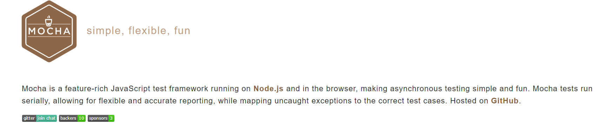
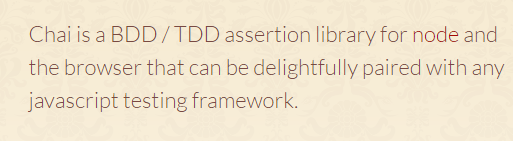

# 前端单元测试示例/Webpack示例

## 框架/库

### 单测
- 测试框架[mocha](https://mochajs.org/)

- 断言库[chai](http://chaijs.com/)

- 辅助测试库[sinon](http://sinonjs.org/)

### 打包
- 编译打包工具[webpack](https://webpack.github.io/)

## 运行

### 浏览器端单测

#### 无需编译直接运行的情况
浏览器直接打开`browser_test/browser/index.html`

#### 需Webpack做打包编译的情况
- 浏览器中测试
运行`node test-server.js`，浏览器打开`http://localhost:3000/test.html`
- Node环境测试
运行`npm test`

### Node端单测
运行`npm test`

#### 覆盖率
运行`npm run cover`，在`coverage`目录会生成html报告

## 单测Case代码

### 浏览器端
- ES5
  - [ES5/jQuery](browser_test/browser/es5.jquery.spec.js)
  - [Ajax](browser_test/browser/ajax.spec.js)
- ES6
  - [ES6](test/browser/index.spec.js)
  - [Promise/Fetch](browser_test/browser/promise.fetch.spec.js)

### Node.js
- ES5
  - [CommonJS](test/node/add.spec.js)
  - [async](test/node/async.spec.js)
  - [timeout](test/node/timeout.spec.js)
- ES6
  - [ES6](test/node/add.spec-es6.js)
  - [Promise](test/node/promise.spec.js)

## Webpack配置

- [开发模式](webpack.config.js)
运行`node dev-server.js`，浏览器打开`http://localhost:3000`
- [测试模式](webpack.test.config.js)
运行`node test-server.js`，浏览器打开`http://localhost:3000/test.html`
- [生产模式](webpack.production.config.js)
运行`npm run build`，在build目录下会生成bundle.js
